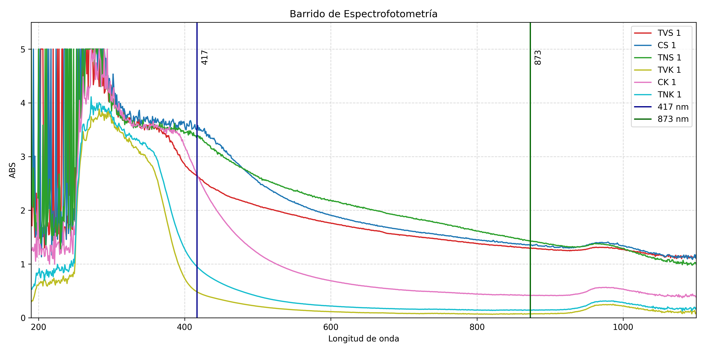

# Visor de Barrido Espectrofotometrico

Esta aplicacion web interactiva desarrollada en Streamlit permite la carga, visualizacion y analisis de datos de barrido espectrofotometrico.

## Caracteristicas

1. Carga de archivos: Soporta archivos CSV y TXT exportados por el espectrofotometro, admitiendo codificaciones UTF-16LE y UTF-8.
2. Visualizacion de espectro: Grafica automaticamente las curvas de absorbancia en funcion de la longitud de onda.
3. Parametros ajustables: Permite al usuario modificar las longitudes de onda de interes (por defecto 417 nm y 873 nm) y el titulo de la grafica.
4. Exportacion de reportes: Genera archivos de Excel con una hoja de resumen de absorbancias en los picos de interes y otra hoja con los datos crudos.
5. Descarga de imagen: Permite guardar la grafica resultante en formato PNG de alta resolucion (300 DPI).

## Requisitos

Es necesario tener Python 3 instalado en el sistema. Las dependencias requeridas se encuentran en el archivo requirements.txt.

Para instalarlas, ejecute el siguiente comando en la terminal:

```bash
pip install -r requirements.txt
```

## Uso

Para iniciar la aplicacion, abra la terminal en el directorio del proyecto y ejecute:

```bash
streamlit run app.py
```
O simplemente abra el siguiente link 
https://josr-k-espectro.streamlit.app/
Esto abrira automaticamente el navegador web predeterminado con la interfaz de la aplicacion.

## Referencia de Diseno

A continuacion se muestra la grafica de referencia original que inspiró el diseno de esta herramienta y los puntos clave de analisis.


